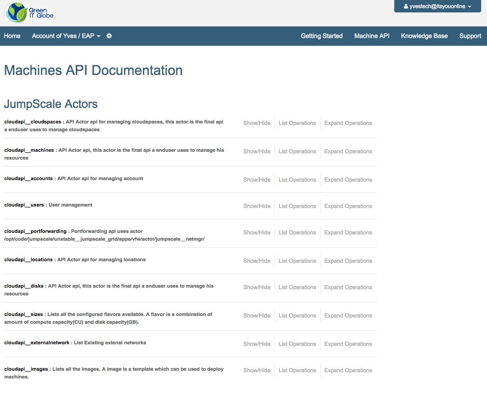
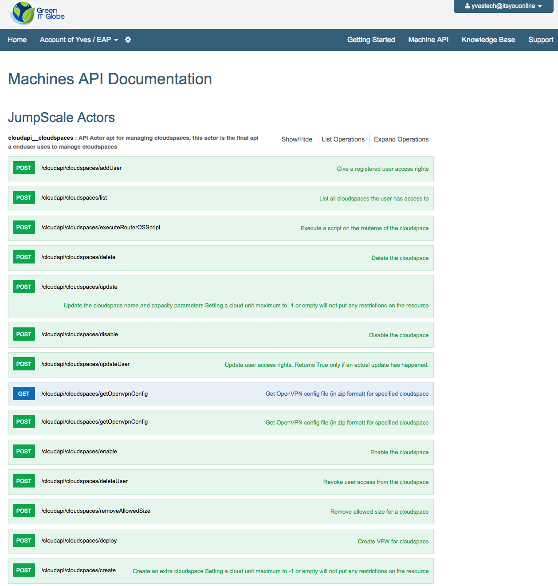
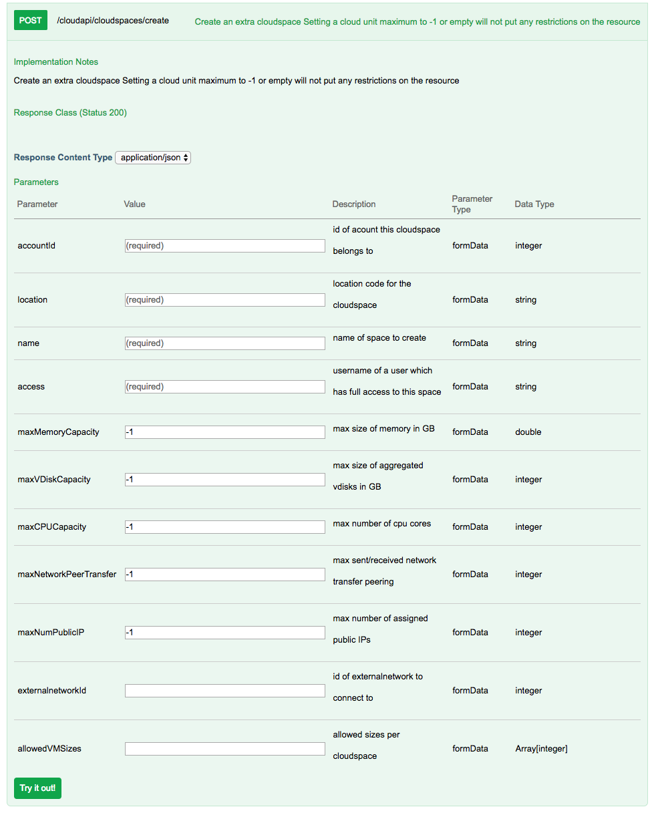

# Getting started with the OpenvCloud Cloud API

- [Swagger UI](#swagger)
- [Command Line](#curl)
- [Using JumpScale](#jumpscale)

<a id="swagger"></a>
## Swagger UI

The **Swagger UI** of the Cloud API is available both in the **End User Portal**, and the **System Portal** as shown in [Cloud API](README.md).

In the **End User Portal** click the **Machine API** in the top menu bar:


From there you can for instance click **cloudapi__cloudspaces** which expands all available API end points related to cloud spaces:


Clicking the **POST /cloudapi/cloudspaces/create** expands a form that allows you to create a cloud space:


Here's an example with some valid values:
[](Images/form.png)

And here's the result when you hit **Try it out!**:
[](Images/result.png)


<a id="curl"></a>
## From the command line

Two options:
- [With JWT from ItsYou.online](#jwt) (recommended)
- [With username/password](#legacy)


### JWT

Prerequirements:
- Registrated user on [ItsYou.online](https://itsyou.online)
- OpenvCloud access rights for the ItsYou.online user

In order to get a JWT from ItsYou.online, you first need to create an application key for your ItsYou.online identity:


Copy the created **Application ID** and **Secret** into environment variables:
```bash
CLIENT_ID="G89h0YmCfjSFXvnbzrcNW_dY96Om"
CLIENT_SECRET="O5ALNpJkgAAr7Ado-exuGvTRfkpN"
```

Get the JWT from ItsYou.online:
```bash
JWT=$(curl -d 'grant_type=client_credentials&client_id='"$CLIENT_ID"'&client_secret='"$CLIENT_SECRET"'&response_type=id_token' https://itsyou.online/v1/oauth/access_token)
```

Get the accounts using the OpenvCloud Cloud API, passing the JWT in the header of the HTTPS request:
```bash
URL="https://dc-1.demo.greenitglobe.com"
curl -X POST -H 'Authorization: bearer '"$JWT" $URL/restmachine/cloudapi/accounts/list
```

<a id ="legacy"></a>
### Username and password

Set the username and password:
```bash
USER_NAME="..."
PASSWORD="..."
```

First get a session key from the Openvcloud Cloud API:
```bash
SESSION_KEY=$(curl -X POST -d 'username='"$USER_NAME"'&password='"$PASSWORD" $URL/restmachine/cloudapi/users/authenticate)
```

List all cloud spaces using the OpenvcCoud Cloud API, passing the session key in the `authkey` query string:
```bash
curl -X POST $URL/restmachine/cloudapi/cloudspaces/list?authkey=$SESSION_KEY
```

<a id="jumpscale"></a>
## Using the JumpScae Interactive Shell

You need an environment with JumpScale9, see https://github.com/Jumpscale/bash for instructions on how to set this up.

The below code uses **JavaScript Object Signing and Encryption** (JOSE), requiring installation of the **python-jose** module:
```bash
pip3 install python-jose
```

Make sure you've exported your client ID and secret:
```bash
export CLIENT_ID
export CLIENT_SECRET
```

In the interactive shell:
```python
import os
import requests
params = {
  'grant_type': 'client_credentials',
  'response_type': 'id_token',
  'client_id': os.environ['CLIENT_ID'],
  'client_secret': os.environ['CLIENT_SECRET'],
  'validity': 3600
}

url = 'https://itsyou.online/v1/oauth/access_token'
resp = requests.post(url, params=params)
resp.raise_for_status()
JWT = resp.content.decode('utf8')

url= "dc-1.demo.greenitglobe.com"
cl = j.clients.openvcloud.get(url, jwt=JWT)
```
