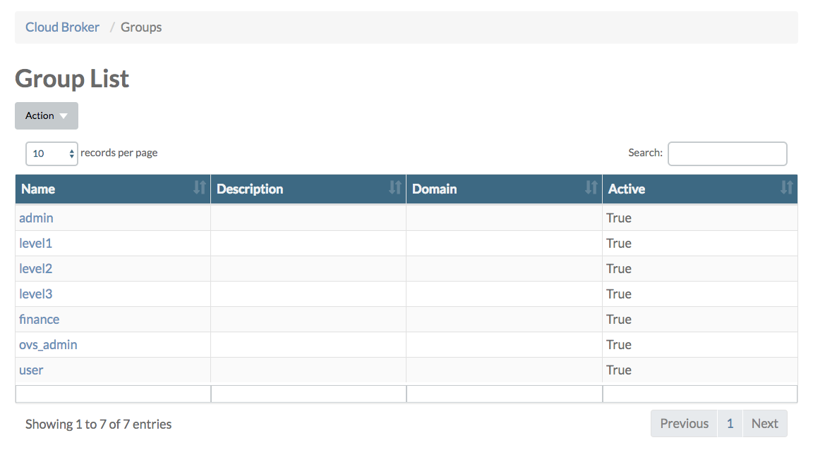
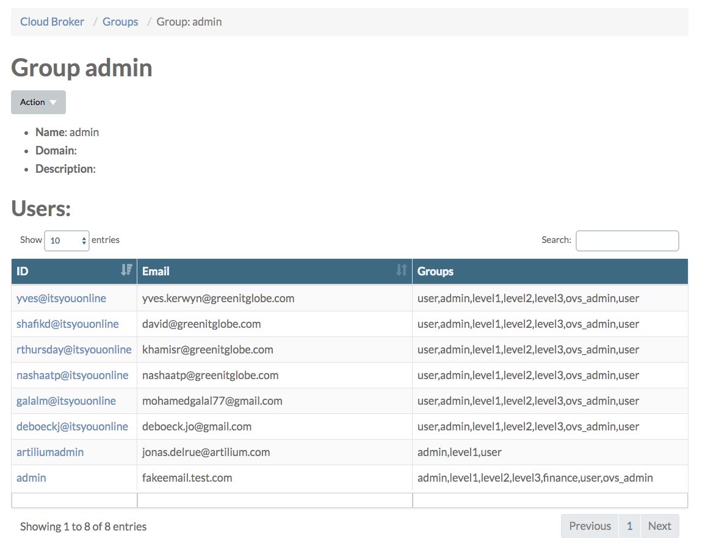

## Groups

In order for users to have access to the various OpenvCloud portals they need to be member of specific groups.

The **Groups** page lists all groups:

There are three main groups:

- The **user** group for restricting which users have access to the [End User Portal](#end-user)
- The **admin** group for restricting which users have access to the [Operator Portals](#operator)
- The **ovs_storage** group for restricing which user have access to the [Storage Portal](#storage)

More details and all other groups are discussed below.

Clicking the **Name** of a group in the **Groups** table brings you to the **Group Details** page of that group:

Under **Users** all users that are member of the group are listed.

By clicking the **ID** of a group you navigate to the **User Details** page of that user.

The **Action** drop down menu allows you to **edit** group properties or **delete** the group.

> Note that on the **Group** page you can also select **Add Group** from the **Actions** menu, allowing you to add/create your own groups. currently however you can't do much with this...

### End User Portal

Within the **End User Portal** specific user rights are further defined by the end user authorization model, discussed [here](/EndUSerPortal/Authorization/AuthorizationModel.md)

The **finance** group is a legacy "sub" group of the **user** group. Membership of the **finance** group was required to access the **Consumption** page in the **End User Portal**; this page got however depreciated.

### Operator Portals

The **Operator Portals** include the **At Your Service Portal**, **Cloud Broker Portal**, **Statistics Portal**, **Grid Portal** and **System Portal**.

Within the **Operator Portals** specific user rights are further defined by membership of one of the following "sub" groups:

- [level1](#level1)
- [level2](#level2)
- [level3](#level3) (not used yet)

> Note that membership of the **level1**, **level2** and **level3** groups also require explicit membership of the **admin** group

**level1** members can only use the "level 1" **Cloud Broker Portal** actions:

| **Accounts**                                             |
|:---------------------------------------------------------|
| Disabling accounts                                       |
| Creating accounts                                        |
| Enabling accounts                                        |
| Renaming accounts                                        |
| Deleting accounts                                        |
| Adding users to an account                               |
| Deleting users from an account                           |

| **Cloud Spaces**                                         |
|:---------------------------------------------------------|
| Create cloud spaces                                      |
| Delete cloud spaces                                      |
| Rename cloud spaces                                      |
| Add users to a cloud space                               |
| Delete users from a cloud space                          |
| Delete Port Forwarding                                   |

| **Private Networks**                                     |
|:---------------------------------------------------------|
| Move virtual firewall to another node                    |
| Reset virtual firewall                                   |
| Start virtual firewall                                   |
| Stop virtual firewall                                    |          
| Remove virtual firewall                                  |
| Deploy virtual firewall                                  |
| Add extra IP address (not exposed in default UI)         |
| Remove IP address (not exposed in default UI)            |

| **Locations**                                            |
|:---------------------------------------------------------|
| Set status (not exposed in default UI)                   |
| Purge logs                                               |
| Check virtual machines                                   |
| Sync available images to Cloud Broker                    |
| Sync available sizes to Cloud Broker                     |

| **Images**                                               |
|:---------------------------------------------------------|
| Delete images                                            |
| Enable images                                            |
| Disable images                                           |
| Set image availability                                   |

| **Virtual Machines**                                     |
|:---------------------------------------------------------|
| Create virtual machines                                  |
| Create virtual machine on specific stack                 |
| Delete virtual machines                                  |
| Start virtual machines                                   |
| Start virtual machines                                   |
| Stop virtual machines                                    |
| Pause virtual machines                                   |
| Resume virtual machines                                  |
| Reboot virtual machines                                  |
| Take snapshots of virtual machines                       |
| Rollback virtual machine to a snapshot                   |
| Delete snapshot of virtual machines                      |
| Clone virtual machines                                   |
| Move virtual machine to another stack                    |
| Export virtual machines (not implemented)                |
| Restore virtual machines                                 |
| List exported virtual machines                           |
| Tag virtual machines                                     |
| Untag virtual machines                                   |
| List virtual machines                                    |
| Check image chain of virtual machines                    |
| Stop virtual machines for abusive resource usage         |
| Backup and destroy virtual machines                      |
| List snapshots of virtual machines                       |
| Get history of virtual machines                          |
| List port forwards of virtual machines                   |
| Create port forwards for virtual machines                |
| Delete port forwards for virtual machines                |
| Add disks to virtual machines                            |
| Delete disks from virtual machines                       |
| Create templates (images) of virtual machines            |
| Update virtual machines                                  |
| Attach virtual machines to public network                |
| Detach virtual machines from public network              |

| **User**                                                 |
|:---------------------------------------------------------|
| Update password of users                                 |
| Create users                                             |
| Send reset password links to users                       |
| Delete users                                             |

**leve2** members can only use the "level 2" **Cloud Broker Portal** actions, which are currently only the following stack actions, available in the **Stack Details** page:

- **Enable**
- **Put in Maintenance**
- **Decommission**

**level3** members can only use the "level 3" **Cloud Broker Portal** actions

> Currently no "level 3" functions have been defined yet, so **level 3** membership will not yield any additional privileges to a user with **admin** group membership.

### Storage Portal

In order to have access to the **Storage Portal**, **ovs_admin** membership is required.
