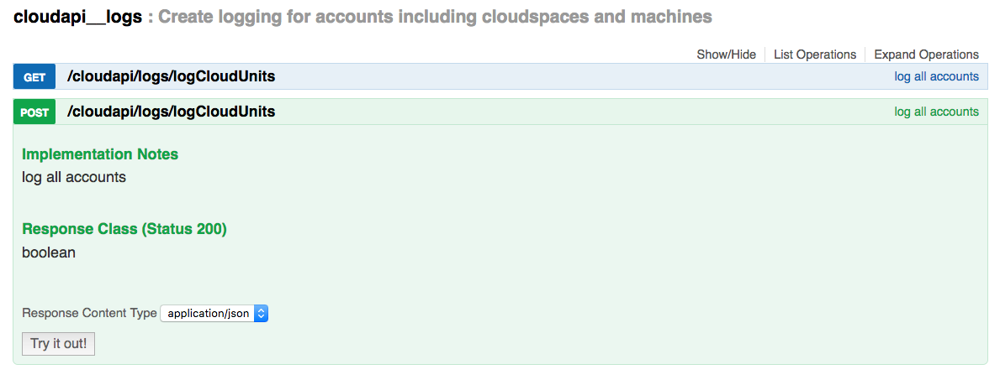

## Cloud Units

On the **ovc_master** virtual machine of your environment every half hour the system will generate a snapshot of the actual used cloud units.

This will be done in the directory `/opt/jumpscale7/var/log/cloudunits`

In order to access these records go through following steps:

- Get to your admin environment with your SSH keys loaded, can be skipped is already on it:

```shell
ssh yves@my-machine -p 7122 -A
```

- Clone the environment repository:

```shell
cd /opt/code/github/0-complexity
git clone %address-of-the-master-copy-of-your-environment-repository%
```

- Get the public IP address of **ovc_git** from `openvcloud__git_vm__main/service.hrd`


- Get to the **ovc_git** machine:

```shell
ssh root@%ovc-git-address% -A -i keys/git_root
```

Get the	private IP address of **ovc_master** from `jumpscale__docker_client__main/service.hrd`

- Get to the **ovc_master** machine via the private network of the master cloud space:

```shell
ssh %ovc-vm-address% -A
````

- Get to the cloud unit records:

```shell
cd /opt/jumpscale7/var/log/cloudunits/%account-ID%
```

For each account there will be a subdirectory, for instance for the account with ID 6 this is `/opt/jumpscale7/var/log/cloudunits/6`

In there you'll find further subdirectories structured as `year/month/day`:

Here's an example of an actual JSON record:

```shell
ls -tr 1
cat 2016_7_19_14_8.json | python -m json.tool`
```

```yaml
{
    "CU_A": 0,
    "CU_C": 2,
    "CU_D": 50,
    "CU_I": 1,
    "CU_M": 2.0,
    "CU_NO": 0,
    "CU_NP": 0,
    "CU_S": 0,
    "account": 7,
    "cloudspaces": [
        {
            "9": {
                "CU_C": 0,
                "CU_D": 0,
                "CU_I": 0,
                "CU_M": 0.0,
                "cloudspaceId": 9,
                "machines": [],
                "name": "testje"
            }
        },
        {
            "23": {
                "CU_C": 0,
                "CU_D": 0,
                "CU_I": 0,
                "CU_M": 0.0,
                "cloudspaceId": 23,
                "machines": [],
                "name": "test2"
            }
        },
        {
            "24": {
                "CU_C": 0,
                "CU_D": 0,
                "CU_I": 0,
                "CU_M": 0.0,
                "cloudspaceId": 24,
                "machines": [],
                "name": "anothertest"
            }
        },
        {
            "28": {
                "CU_C": 0,
                "CU_D": 0,
                "CU_I": 0,
                "CU_M": 0.0,
                "cloudspaceId": 28,
                "machines": [],
                "name": "4real3"
            }
        },
        {
            "29": {
                "CU_C": 2,
                "CU_D": 50,
                "CU_I": 1,
                "CU_M": 2.0,
                "cloudspaceId": 29,
                "machines": [
                    {
                        "1054": {
                            "CU_C": 2,
                            "CU_D": 50,
                            "CU_I": 0,
                            "CU_M": 2048,
                            "id": 1054,
                            "imagename": "Ubuntu 14.04 x64"
                            "name": "Test machine"
                        }
                    }
                ],
                "name": "4real4"
            }
        }
    ],
    "name": "Account of Moehaha.com"
}
```

This shows both an aggregated and per cloud space snapshot of the used cloud units, using following labels:

- **CU_C**: Virtual CPUs
- **CU_D**: Boot disk, expressed in GB
- **CU_S**: Primary storage capacity (NAS)
- **CU_A**: Secondary storage capacity (Archive)
- **CU_I**: Number of public IP addresses
- **CU_M**: Memory, expressed in GB
- **CU_NO**: Network transfer in operator, expressed in GB send/received
- **CU_NP**: Network transfer peering, expressed in GB send/received

At the machine-level notice following fields:
- **id**: ID of the virtual machine, in the above example check the virtual machine with `"id": 1054`
- **imagename**: Name of the OS image used by the virtual machine, in the above example: `"imagename": "Ubuntu 14.04 x64"``
- **name**: Name of the virtual machine, in the above example: `"name": "Test machine"`

These records are generated every 30 minutes. You can also trigger the creation process using the following Rest API:

https://%address-of-your-environment%/system/ActorApi?group=cloudapi#!/cloudapi__logs/post_cloudapi_logs_logCloudUnits


